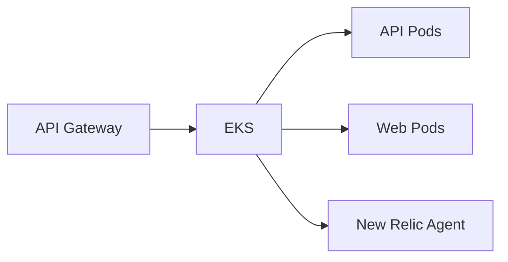

# AutoCare Hub - Infraestrutura Kubernetes

Infraestrutura de Kubernetes para a fase 3 do AutoCare Hub.

## Escopo

- Cluster Kubernetes/EKS
- Namespaces
- HPA
- Services e Deployments da aplicacao
- API Gateway/Ingress
- Repositorios ECR
- Integracao New Relic

## Deploy

```powershell
cd terraform
terraform init
terraform plan
terraform apply
```

## Arquitetura especifica


