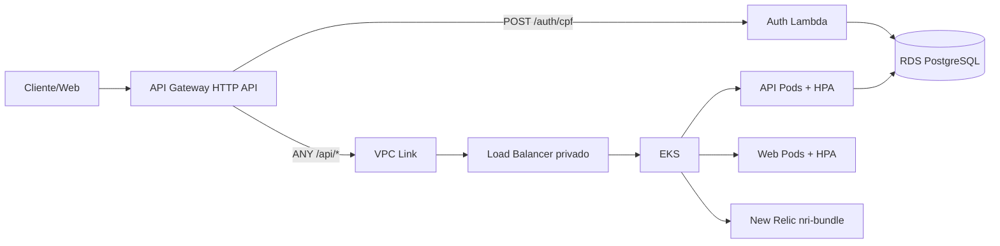

# AutoCare Hub - Infraestrutura Kubernetes

Infraestrutura Kubernetes e API Gateway da fase 3 do AutoCare Hub.

## Escopo

- Amazon EKS real com managed node group.
- Repositorios ECR para API e frontend.
- API Gateway HTTP API.
- Rota `POST /auth/cpf` integrada com a Lambda de autenticacao por CPF.
- Rota `ANY /api/{proxy+}` integrada com a API no EKS por VPC Link e listener privado.
- Namespace `autocarehub`.
- New Relic Kubernetes integration via Helm `nri-bundle`.
- Manifests de aplicacao com Deployments, Services, probes e HPAs.

## Secrets do GitHub

Configure nos environments `homolog` e `production`:

- `AWS_ACCESS_KEY_ID`
- `AWS_SECRET_ACCESS_KEY`
- `AWS_REGION`
- `TF_STATE_BUCKET`
- `TF_LOCK_TABLE`
- `EKS_CLUSTER_NAME`
- `VPC_ID`
- `PRIVATE_SUBNET_IDS_JSON`, exemplo `["subnet-a","subnet-b"]`
- `PUBLIC_SUBNET_IDS_JSON`, exemplo `["subnet-c","subnet-d"]`
- `API_BACKEND_LISTENER_ARN`
- `AUTH_LAMBDA_INVOKE_ARN`
- `AUTH_LAMBDA_FUNCTION_NAME`
- `NEW_RELIC_LICENSE_KEY`

## Deploy

```powershell
cd terraform
terraform init `
  -backend-config="bucket=<bucket-state>" `
  -backend-config="key=autocarehub-k8s/hml/terraform.tfstate" `
  -backend-config="region=<regiao>" `
  -backend-config="dynamodb_table=<tabela-lock>"
terraform plan
terraform apply
```

## Aplicacao

Os manifests YAML deste repo mantem a referencia academica/local. Em AWS, as imagens devem ser substituidas pelas URLs ECR publicadas pelos repos `SOAT-FIAP-autocare-api` e `SOAT-FIAP-autocare-web`.

## Arquitetura especifica


