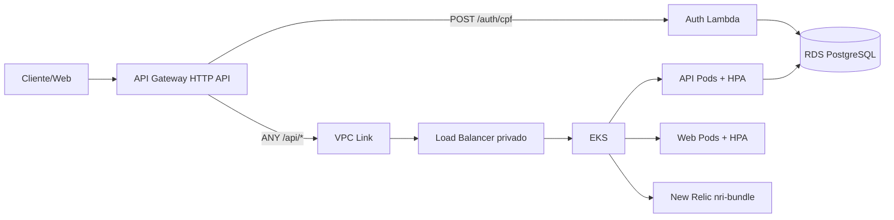

# AutoCare Hub - Infraestrutura Kubernetes e API Gateway

Terraform e manifests Kubernetes da Fase 3. Este repositorio provisiona EKS, ECR, API Gateway, integracoes com Lambda/API e New Relic Kubernetes integration.

## Papel na Arquitetura

O `infra-k8s` cria a camada de execucao e entrada HTTP da solucao. Ele conecta o API Gateway ao endpoint serverless de CPF e ao backend em Kubernetes.



## Escopo

- Amazon EKS real com managed node group.
- Repositorios ECR para API e frontend.
- API Gateway HTTP API.
- Rota `POST /auth/cpf` integrada com a Lambda de autenticacao por CPF.
- Rota `ANY /api/{proxy+}` integrada com a API no EKS por VPC Link e listener privado.
- Namespace `autocarehub`.
- New Relic Kubernetes integration via Helm `nri-bundle`.
- Manifests de aplicacao com Deployments, Services, probes e HPAs.
- Backend remoto Terraform em S3 com lock em DynamoDB.

## Tecnologias

- Terraform
- Amazon EKS
- Amazon ECR
- Amazon API Gateway HTTP API
- AWS Lambda integration
- Kubernetes HPA
- Helm
- New Relic Kubernetes integration
- GitHub Actions

## Secrets do GitHub

Configure nos environments `homolog` e `production`:

- `AWS_ACCESS_KEY_ID`
- `AWS_SECRET_ACCESS_KEY`
- `AWS_REGION`
- `TF_STATE_BUCKET`
- `TF_LOCK_TABLE`
- `EKS_CLUSTER_NAME`
- `VPC_ID`
- `PRIVATE_SUBNET_IDS_JSON`, exemplo `["subnet-a","subnet-b"]`
- `PUBLIC_SUBNET_IDS_JSON`, exemplo `["subnet-c","subnet-d"]`
- `API_BACKEND_LISTENER_ARN`
- `AUTH_LAMBDA_INVOKE_ARN`
- `AUTH_LAMBDA_FUNCTION_NAME`
- `NEW_RELIC_LICENSE_KEY`

## Deploy Manual

```powershell
cd terraform
terraform init `
  -backend-config="bucket=<bucket-state>" `
  -backend-config="key=autocarehub-k8s/hml/terraform.tfstate" `
  -backend-config="region=<regiao>" `
  -backend-config="dynamodb_table=<tabela-lock>"
terraform plan
terraform apply
```

## CI/CD

- Pull Requests: `terraform fmt`, `terraform init -backend=false`, `terraform validate` e `terraform plan`.
- Branches `homolog` e `main`: `terraform apply` automatico apos validacao.

## Aplicacao

Os manifests YAML deste repo mantem Deployments, Services e HPAs da API e do Web. Em AWS, as imagens devem ser substituidas pelas URLs ECR publicadas pelos repos `SOAT-FIAP-autocare-api` e `SOAT-FIAP-autocare-web`.

## Observabilidade

O chart `nri-bundle` envia dados de cluster, pods, nodes e metricas Prometheus ao New Relic. A API tambem envia APM/logs pelo Java Agent.

Dashboards esperados na UI do New Relic:

- Latencia e taxa de erro das APIs.
- CPU/memoria de pods e nodes.
- Uptime e healthcheck da API.
- Volume diario de ordens de servico.
- Tempo medio por status: Diagnostico, Execucao e Finalizacao.
- Falhas em processamento de ordens de servico.

## Configuracoes Manuais Depois

- Criar bucket S3 de state e tabela DynamoDB de lock.
- Confirmar VPC, subnets e rotas privadas.
- Criar/obter listener privado usado por `API_BACKEND_LISTENER_ARN`.
- Preencher invoke ARN/nome da Lambda depois do deploy do repo `auth-lambda`.
- Configurar license key do New Relic.
- Ajustar DNS, CORS e dominios se houver dominio proprio.

## Links

- Repositorio: https://github.com/yxsbx/SOAT-FIAP-autocare-infra-k8s
- Documentacao central: https://github.com/yxsbx/SOAT-FIAP-autocare-api/tree/fase-3/docs
